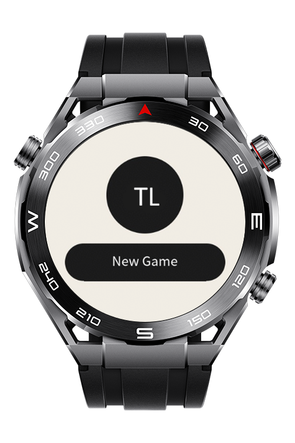
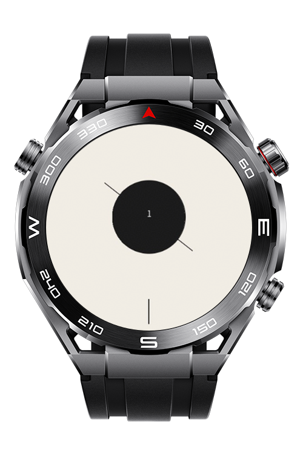
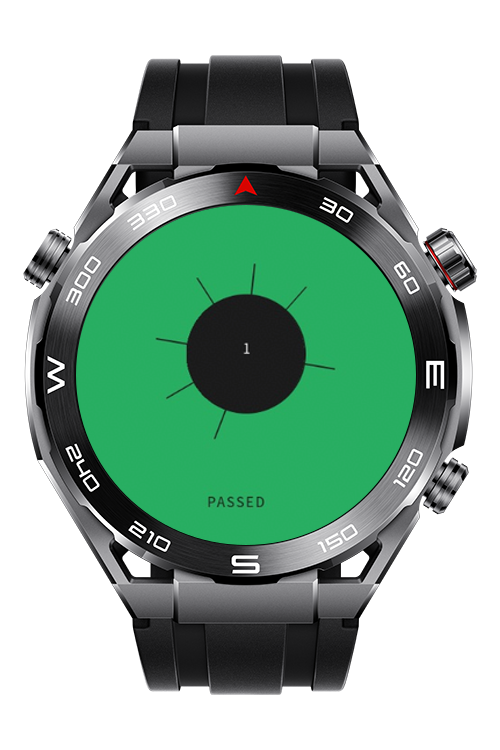
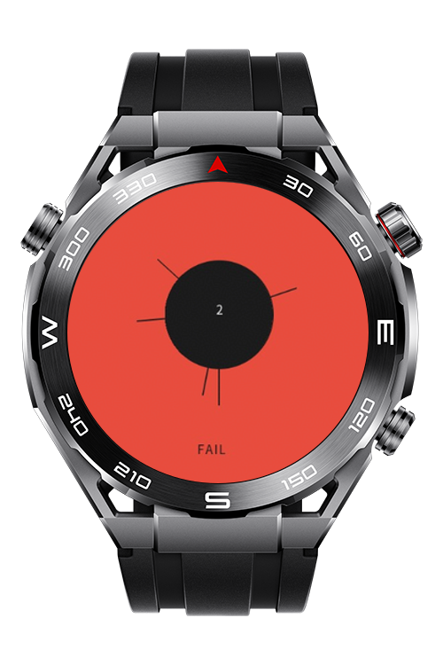

> **Note:** To access all shared projects, get information about environment setup, and view other guides, please visit [Explore-In-HMOS-Wearable Index](https://github.com/Explore-In-HMOS-Wearable/hmos-index).

# Throw the Lines

Throw the Lines is a demo game app that challenges users to carefully place balls on a rotating circle without hitting existing ones. It includes classic and advanced game modes and guides you step‑by‑step through levels. Using Sensor Kit, assist with timing and control for a more precise gameplay experience.

# Preview
<div>
  
  
  
  
</div>

# Use Cases

Throw the Lines lets users:

* Play classic mode with increasing difficulty and advanced mode with special challenges.
* Follow step-by-step level progression.

# Tech Stack

Languages: JS, CSS, HML
Frameworks: HarmonyOS SDK 5.1.0(18)
Tools: DevEco Studio Vers 5.1.0.820

# Directory Structure

```
  entry/src/main/ets/
  |---entryability
  |   |---EntryAbility.ets
  |---entrybackupability
  |   |---EntryBackupAbility.ets
  |---model
  |   |---LevelConfig.ets
  |   |---ScreenState.ets
  |---pages
  |   |---Index.ets                       
  |---service
  |   |---DrawService.ets                 
  |   |---LevelService.ets                 
  |---util
  |   |---ConstantUI.ets                 
  |---viewmodel
  |   |---GameViewModel.ets                 

```

# Constraints and Restrictions
## Supported Devices
- Huawei Sport (Lite) Watch GT 4/5/6
- Huawei Sport (Lite) GT4/5 Pro
- Huawei Sport (Lite) Fit 3/4
- Huawei Sport (Lite) D2
- Huawei Sport (Lite) Ultimate

# LICENSE

Throw the Lines is distributed under the terms of the MIT License.  
See the [LICENSE](/LICENSE) for more information.